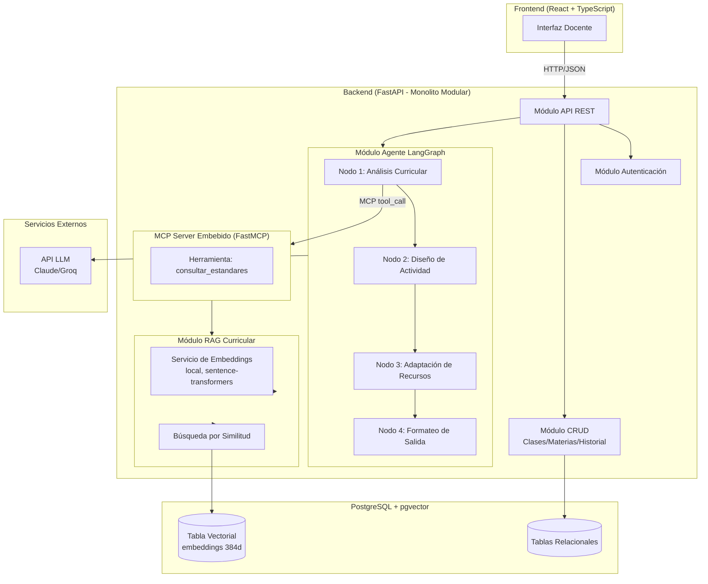
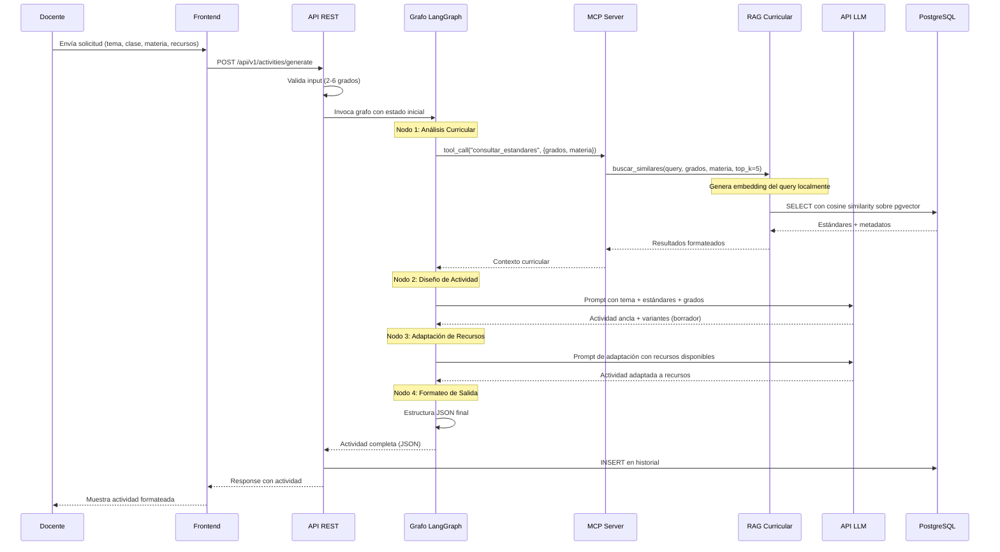
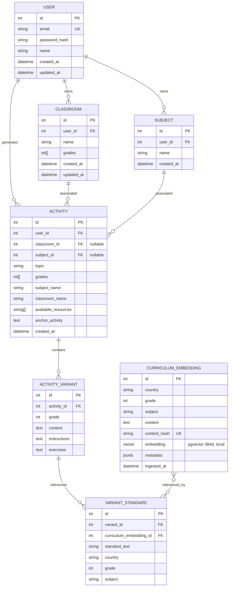

# Documento de Diseño Técnico — Aula Múltiple

## Overview

Aula Múltiple es un sistema web que combina un agente de IA basado en LangGraph con recuperación aumentada por generación (RAG) sobre estándares curriculares para generar actividades pedagógicas diferenciadas por grado. La arquitectura sigue un patrón de monolito modular donde un único proceso FastAPI contiene todos los módulos internos: API REST, orquestador LangGraph (4 nodos secuenciales con MCP Server embebido), módulo RAG (pgvector) y módulo CRUD de datos de usuario/historial.

### Decisiones de Diseño Clave

| Decisión | Justificación |
|----------|---------------|
| Monolito modular (no microservicios) | Simplicidad operacional para un equipo pequeño; un solo proceso reduce latencia inter-módulo |
| LangGraph con 4 nodos secuenciales | Flujo predecible y trazable; cada nodo tiene responsabilidad única |
| MCP Server embebido (in-process, FastMCP) | Evita overhead de red; API de alto nivel del SDK MCP para minimizar código |
| pgvector en PostgreSQL | Un solo motor de BD para datos relacionales y vectoriales; simplifica operaciones |
| Embeddings locales (sentence-transformers) | Sin costo, sin dependencia de red ni API key externa; corre en CPU; coherente con el caso de uso de conectividad limitada |
| SQLAlchemy 2.0 async + asyncpg | Rendimiento no-bloqueante para I/O de base de datos |
| JWT stateless | Escalabilidad sin necesidad de sesiones en servidor |
| Alembic para migraciones | Versionado de esquema reproducible en Docker |

## Architecture

### Diagrama de Arquitectura de Alto Nivel



### Flujo de Generación de Actividades



## Components and Interfaces

### Estructura del Proyecto

aula_multiple/
├── backend/
│   ├── app/
│   │   ├── __init__.py
│   │   ├── main.py                    # FastAPI app factory
│   │   ├── config.py                  # Settings con pydantic-settings
│   │   ├── dependencies.py            # Dependencias compartidas (DB session, auth)
│   │   │
│   │   ├── api/                       # Módulo API REST
│   │   │   ├── __init__.py
│   │   │   ├── router.py             # Router principal v1
│   │   │   ├── activities.py         # Endpoints de generación
│   │   │   ├── history.py            # Endpoints de historial
│   │   │   ├── classes.py            # Endpoints de clases
│   │   │   ├── subjects.py           # Endpoints de materias
│   │   │   └── auth.py              # Endpoints de autenticación
│   │   │
│   │   ├── agent/                     # Módulo Agente LangGraph
│   │   │   ├── __init__.py
│   │   │   ├── graph.py             # Definición del StateGraph
│   │   │   ├── state.py             # TypedDict del estado
│   │   │   ├── nodes/
│   │   │   │   ├── __init__.py
│   │   │   │   ├── curriculum_analysis.py
│   │   │   │   ├── activity_design.py
│   │   │   │   ├── resource_adaptation.py
│   │   │   │   └── output_formatting.py
│   │   │   └── prompts/
│   │   │       ├── curriculum_analysis.txt
│   │   │       ├── activity_design.txt
│   │   │       └── resource_adaptation.txt
│   │   │
│   │   ├── mcp_server/               # MCP Server Embebido
│   │   │   ├── __init__.py
│   │   │   ├── server.py            # Instancia FastMCP
│   │   │   └── tools.py             # Herramientas expuestas
│   │   │
│   │   ├── rag/                       # Módulo RAG Curricular
│   │   │   ├── __init__.py
│   │   │   ├── retriever.py         # Lógica de búsqueda semántica
│   │   │   └── embeddings.py        # Servicio de embeddings local
│   │   │
│   │   ├── crud/                      # Módulo CRUD
│   │   │   ├── __init__.py
│   │   │   ├── history.py
│   │   │   ├── classes.py
│   │   │   ├── subjects.py
│   │   │   └── users.py
│   │   │
│   │   ├── models/                    # Modelos SQLAlchemy
│   │   │   ├── __init__.py
│   │   │   ├── base.py
│   │   │   ├── user.py
│   │   │   ├── classroom.py
│   │   │   ├── subject.py
│   │   │   ├── activity.py
│   │   │   └── curriculum_embedding.py
│   │   │
│   │   ├── schemas/                   # Schemas Pydantic
│   │   │   ├── __init__.py
│   │   │   ├── auth.py
│   │   │   ├── activity.py
│   │   │   ├── classroom.py
│   │   │   ├── subject.py
│   │   │   └── history.py
│   │   │
│   │   └── auth/                      # Módulo Autenticación
│   │       ├── __init__.py
│   │       ├── jwt.py
│   │       └── security.py
│   │
│   ├── scripts/
│   │   └── ingest_curriculum.py       # Script de ingesta offline
│   │
│   ├── alembic/                       # Migraciones
│   │   ├── alembic.ini
│   │   └── versions/
│   │
│   ├── tests/
│   ├── Dockerfile
│   └── requirements.txt
│
├── frontend/
│   ├── src/
│   │   ├── components/
│   │   ├── pages/
│   │   ├── hooks/
│   │   ├── services/
│   │   ├── types/
│   │   └── App.tsx
│   ├── package.json
│   └── Dockerfile
│
├── docker-compose.yml
├── .env.example
└── README.md

### Interfaces de Componentes (Firmas de Funciones)

#### Módulo Agente — Estado del Grafo

```python
# app/agent/state.py
from typing import TypedDict, Optional
from app.schemas.activity import ActivityOutput, CurriculumStandard

class AgentState(TypedDict):
    # Entrada
    topic: str
    grades: list[int]
    subject: str
    available_resources: list[str]
    # Nodo 1 output
    curriculum_standards: list[CurriculumStandard]
    # Nodo 2 output
    anchor_activity_draft: Optional[str]
    variants_draft: Optional[dict[int, str]]
    # Nodo 3 output
    anchor_activity_adapted: Optional[str]
    variants_adapted: Optional[dict[int, str]]
    # Nodo 4 output
    final_output: Optional[ActivityOutput]
    # Control
    current_node: str
    error: Optional[str]
```

#### Módulo Agente — Definición del Grafo

```python
# app/agent/graph.py
from langgraph.graph import StateGraph, END
from app.agent.state import AgentState
from app.agent.nodes import (
    curriculum_analysis,
    activity_design,
    resource_adaptation,
    output_formatting,
)

def build_activity_graph() -> StateGraph:
    """Construye el grafo secuencial de 4 nodos para generación de actividades."""
    graph = StateGraph(AgentState)
    graph.add_node("curriculum_analysis", curriculum_analysis.run)
    graph.add_node("activity_design", activity_design.run)
    graph.add_node("resource_adaptation", resource_adaptation.run)
    graph.add_node("output_formatting", output_formatting.run)
    
    graph.set_entry_point("curriculum_analysis")
    graph.add_edge("curriculum_analysis", "activity_design")
    graph.add_edge("activity_design", "resource_adaptation")
    graph.add_edge("resource_adaptation", "output_formatting")
    graph.add_edge("output_formatting", END)
    
    return graph.compile()
```

#### Módulo Agente — Nodos

```python
# app/agent/nodes/curriculum_analysis.py
from app.agent.state import AgentState

async def run(state: AgentState) -> AgentState:
    """
    Nodo 1: Invoca la herramienta MCP 'consultar_estandares' para recuperar
    estándares curriculares relevantes para los grados y materia dados.
    
    Input: state.topic, state.grades, state.subject
    Output: state.curriculum_standards (lista de CurriculumStandard)
    Errores: Captura excepciones y las registra en state.error
    """
    ...

# app/agent/nodes/activity_design.py
async def run(state: AgentState) -> AgentState:
    """
    Nodo 2: Genera la actividad ancla y variantes por grado usando el LLM,
    incorporando los estándares curriculares recuperados.
    
    Input: state.topic, state.grades, state.curriculum_standards
    Output: state.anchor_activity_draft, state.variants_draft
    """
    ...

# app/agent/nodes/resource_adaptation.py
async def run(state: AgentState) -> AgentState:
    """
    Nodo 3: Adapta las instrucciones de la actividad según los recursos
    disponibles del docente. Si no hay recursos especificados, asume básicos.
    Nota: esta es una segunda llamada al LLM independiente del Nodo 2;
    se mantiene separada por claridad de responsabilidad, con el timeout
    de 60s aplicado individualmente a cada llamada.
    
    Input: state.anchor_activity_draft, state.variants_draft, state.available_resources
    Output: state.anchor_activity_adapted, state.variants_adapted
    """
    ...

# app/agent/nodes/output_formatting.py
async def run(state: AgentState) -> AgentState:
    """
    Nodo 4: Estructura la salida final en formato JSON con campos separados
    para la actividad ancla y cada variante.
    
    Input: state.anchor_activity_adapted, state.variants_adapted, state.curriculum_standards
    Output: state.final_output (ActivityOutput validado con Pydantic)
    """
    ...
```

#### MCP Server Embebido (FastMCP)

```python
# app/mcp_server/server.py
from mcp.server.fastmcp import FastMCP

mcp = FastMCP("aula-multiple-curriculum")

# app/mcp_server/tools.py
from app.mcp_server.server import mcp
from app.rag.retriever import CurriculumRetriever

@mcp.tool()
async def consultar_estandares(
    query: str,
    grades: list[int],
    subject: str,
    country: str | None = None,
    top_k: int = 5,
) -> list[dict]:
    """
    Recupera estándares curriculares relevantes mediante búsqueda semántica.
    
    Args:
        query: Texto de búsqueda (típicamente el tema de la actividad)
        grades: Lista de grados escolares a consultar
        subject: Materia/asignatura
        country: País (opcional, filtra por país específico)
        top_k: Número máximo de resultados a retornar
        
    Returns:
        Lista de estándares con: país, grado, materia, texto, score
    """
    ...
```

#### Módulo RAG Curricular

```python
# app/rag/retriever.py
from sqlalchemy.ext.asyncio import AsyncSession
from app.schemas.activity import CurriculumStandard

class CurriculumRetriever:
    def __init__(self, session: AsyncSession, embedding_service: "EmbeddingService"):
        self.session = session
        self.embedding_service = embedding_service
    
    async def search(
        self,
        query: str,
        grades: list[int],
        subject: str,
        country: str | None = None,
        top_k: int = 5,
        similarity_threshold: float = 0.7,
    ) -> list[CurriculumStandard]:
        """
        Busca estándares curriculares por similitud semántica.
        
        Proceso:
        1. Genera embedding local del query (sentence-transformers)
        2. Ejecuta búsqueda cosine similarity en pgvector
        3. Filtra por grado, materia y umbral de similitud
        4. Retorna top_k resultados ordenados por score
        
        Returns:
            Lista vacía si ningún resultado supera el umbral
        """
        ...

# app/rag/embeddings.py
from sentence_transformers import SentenceTransformer

class EmbeddingService:
    """
    Genera embeddings localmente usando sentence-transformers (all-MiniLM-L6-v2,
    384 dimensiones). Corre en CPU, sin llamadas de red ni API key externa.
    El modelo se carga una sola vez al iniciar el proceso.
    """
    
    def __init__(self, model_name: str = "all-MiniLM-L6-v2"):
        self.model = SentenceTransformer(model_name)
    
    async def generate(self, text: str) -> list[float]:
        """Genera embedding vectorial (384d) para un texto dado, localmente."""
        ...
    
    async def generate_batch(self, texts: list[str]) -> list[list[float]]:
        """Genera embeddings en batch para múltiples textos, localmente."""
        ...
```

#### Módulo API REST — Endpoints Principales

```python
# app/api/activities.py
from fastapi import APIRouter, Depends, HTTPException
from app.schemas.activity import GenerateRequest, ActivityOutput
from app.dependencies import get_current_user, get_db

router = APIRouter(prefix="/activities", tags=["activities"])

@router.post("/generate", response_model=ActivityOutput)
async def generate_activity(
    request: GenerateRequest,
    current_user = Depends(get_current_user),
    db = Depends(get_db),
) -> ActivityOutput:
    """
    Genera una actividad pedagógica con variantes por grado.
    Timeout: 60s hacia API LLM (por cada llamada al LLM dentro del grafo).
    Valida: 2-6 grados en la clase.
    """
    ...

# app/api/history.py
router = APIRouter(prefix="/history", tags=["history"])

@router.get("/", response_model=list[HistorySummary])
async def list_history(
    subject_id: int | None = None,
    class_id: int | None = None,
    search: str | None = None,
    current_user = Depends(get_current_user),
    db = Depends(get_db),
):
    """Retorna historial del docente, filtrable por materia, clase o keyword."""
    ...

@router.get("/{activity_id}", response_model=ActivityOutput)
async def get_activity(activity_id: int, ...):
    """Retorna actividad completa con ancla, variantes y estándares."""
    ...

@router.delete("/{activity_id}")
async def delete_activity(activity_id: int, ...):
    """Elimina actividad del historial de forma permanente."""
    ...
```

#### Módulo Autenticación

```python
# app/auth/jwt.py
from datetime import timedelta

def create_access_token(user_id: int, expires_delta: timedelta | None = None) -> str:
    """Crea JWT con user_id en el payload y expiración configurable."""
    ...

def verify_token(token: str) -> dict:
    """Verifica y decodifica JWT. Lanza HTTPException 401 si inválido/expirado."""
    ...

# app/auth/security.py
def hash_password(password: str) -> str:
    """Hash con bcrypt."""
    ...

def verify_password(plain: str, hashed: str) -> bool:
    """Verifica contraseña contra hash bcrypt."""
    ...

# app/api/auth.py
router = APIRouter(prefix="/auth", tags=["auth"])

@router.post("/register", response_model=UserResponse, status_code=201)
async def register(data: RegisterRequest, db = Depends(get_db)):
    """Registra nuevo docente con email y contraseña hasheada."""
    ...

@router.post("/login", response_model=TokenResponse)
async def login(data: LoginRequest, db = Depends(get_db)):
    """Autentica y emite JWT."""
    ...
```

#### Módulo CRUD — Clases y Materias

```python
# app/api/classes.py
router = APIRouter(prefix="/classes", tags=["classes"])

@router.post("/", response_model=ClassroomResponse, status_code=201)
async def create_class(data: ClassroomCreate, ...):
    """Crea clase con nombre y lista de grados (2-6)."""
    ...

@router.put("/{class_id}", response_model=ClassroomResponse)
async def update_class(class_id: int, data: ClassroomUpdate, ...):
    """Actualiza grados de una clase. Historial existente se conserva."""
    ...

@router.delete("/{class_id}")
async def delete_class(class_id: int, ...):
    """Elimina clase. Historial se conserva como registros independientes."""
    ...

# app/api/subjects.py  
router = APIRouter(prefix="/subjects", tags=["subjects"])

@router.post("/", response_model=SubjectResponse, status_code=201)
async def create_subject(data: SubjectCreate, ...):
    """Crea materia asociada al docente."""
    ...

@router.delete("/{subject_id}")
async def delete_subject(subject_id: int, ...):
    """Elimina materia. Historial se conserva."""
    ...
```

#### Script de Ingesta

```python
# scripts/ingest_curriculum.py
import asyncio
from pathlib import Path

async def ingest_document(
    pdf_path: Path,
    country: str,
    grade: int,
    subject: str,
    chunk_size: int = 500,
    chunk_overlap: int = 50,
) -> int:
    """
    Procesa un PDF curricular y almacena embeddings en pgvector.
    
    Proceso:
    1. Extrae texto del PDF (PyPDF2/pdfplumber)
    2. Divide en chunks con overlap
    3. Genera embeddings localmente por chunk (batch, sentence-transformers)
    4. Verifica duplicados por hash del contenido
    5. Inserta en tabla curriculum_embeddings
    
    Returns:
        Número de chunks procesados y almacenados
    """
    ...

if __name__ == "__main__":
    # CLI independiente del servidor
    asyncio.run(main())
```

## Data Models

### Diagrama Entidad-Relación



### Modelos SQLAlchemy

```python
# app/models/user.py
from sqlalchemy import Column, Integer, String, DateTime
from app.models.base import Base

class User(Base):
    __tablename__ = "users"
    
    id = Column(Integer, primary_key=True)
    email = Column(String(255), unique=True, nullable=False, index=True)
    password_hash = Column(String(255), nullable=False)
    name = Column(String(255), nullable=False)
    created_at = Column(DateTime, server_default="now()")
    updated_at = Column(DateTime, server_default="now()", onupdate="now()")

# app/models/classroom.py
from sqlalchemy import Column, Integer, String, ForeignKey, ARRAY, DateTime
from sqlalchemy.orm import relationship

class Classroom(Base):
    __tablename__ = "classrooms"
    
    id = Column(Integer, primary_key=True)
    user_id = Column(Integer, ForeignKey("users.id"), nullable=False, index=True)
    name = Column(String(255), nullable=False)
    grades = Column(ARRAY(Integer), nullable=False)  # Validación: len 2-6
    created_at = Column(DateTime, server_default="now()")
    updated_at = Column(DateTime, server_default="now()", onupdate="now()")
    
    user = relationship("User", back_populates="classrooms")

# app/models/subject.py
class Subject(Base):
    __tablename__ = "subjects"
    
    id = Column(Integer, primary_key=True)
    user_id = Column(Integer, ForeignKey("users.id"), nullable=False, index=True)
    name = Column(String(255), nullable=False)
    created_at = Column(DateTime, server_default="now()")
    
    user = relationship("User", back_populates="subjects")

# app/models/activity.py
from sqlalchemy import Column, Integer, String, Text, ForeignKey, ARRAY, DateTime
from sqlalchemy.orm import relationship

class Activity(Base):
    __tablename__ = "activities"
    
    id = Column(Integer, primary_key=True)
    user_id = Column(Integer, ForeignKey("users.id"), nullable=False, index=True)
    classroom_id = Column(Integer, ForeignKey("classrooms.id"), nullable=True)
    subject_id = Column(Integer, ForeignKey("subjects.id"), nullable=True)
    topic = Column(String(500), nullable=False)
    grades = Column(ARRAY(Integer), nullable=False)
    subject_name = Column(String(255), nullable=False)
    classroom_name = Column(String(255), nullable=True)
    available_resources = Column(ARRAY(String), nullable=True)
    anchor_activity = Column(Text, nullable=False)
    created_at = Column(DateTime, server_default="now()", index=True)
    
    variants = relationship("ActivityVariant", back_populates="activity", cascade="all, delete-orphan")

class ActivityVariant(Base):
    __tablename__ = "activity_variants"
    
    id = Column(Integer, primary_key=True)
    activity_id = Column(Integer, ForeignKey("activities.id", ondelete="CASCADE"))
    grade = Column(Integer, nullable=False)
    content = Column(Text, nullable=False)
    instructions = Column(Text, nullable=False)
    exercises = Column(Text, nullable=False)
    
    activity = relationship("Activity", back_populates="variants")
    standards = relationship("VariantStandard", back_populates="variant", cascade="all, delete-orphan")

class VariantStandard(Base):
    __tablename__ = "variant_standards"
    
    id = Column(Integer, primary_key=True)
    variant_id = Column(Integer, ForeignKey("activity_variants.id", ondelete="CASCADE"))
    curriculum_embedding_id = Column(Integer, ForeignKey("curriculum_embeddings.id"), nullable=True)
    standard_text = Column(Text, nullable=False)
    country = Column(String(100), nullable=False)
    grade = Column(Integer, nullable=False)
    subject = Column(String(255), nullable=False)
    
    variant = relationship("ActivityVariant", back_populates="standards")
```

```python
# app/models/curriculum_embedding.py
from pgvector.sqlalchemy import Vector
from sqlalchemy import Column, Integer, String, Text, DateTime, JSON

class CurriculumEmbedding(Base):
    __tablename__ = "curriculum_embeddings"
    
    id = Column(Integer, primary_key=True)
    country = Column(String(100), nullable=False, index=True)
    grade = Column(Integer, nullable=False, index=True)
    subject = Column(String(255), nullable=False, index=True)
    content = Column(Text, nullable=False)
    content_hash = Column(String(64), unique=True, nullable=False)  # SHA-256 para deduplicación
    embedding = Column(Vector(384), nullable=False)  # all-MiniLM-L6-v2, local, sin API externa
    metadata = Column(JSON, nullable=True)  # Metadatos adicionales del documento
    ingested_at = Column(DateTime, server_default="now()")
```

### Schemas Pydantic (Request/Response)

```python
# app/schemas/activity.py
from pydantic import BaseModel, Field, field_validator

class GenerateRequest(BaseModel):
    topic: str = Field(..., min_length=3, max_length=500)
    classroom_id: int | None = None
    subject_id: int | None = None
    grades: list[int] = Field(..., min_length=2, max_length=6)
    subject_name: str = Field(..., min_length=1, max_length=255)
    available_resources: list[str] | None = None
    
    @field_validator("grades")
    @classmethod
    def validate_grades(cls, v):
        if not all(1 <= g <= 12 for g in v):
            raise ValueError("Cada grado debe estar entre 1 y 12")
        if len(v) != len(set(v)):
            raise ValueError("Los grados no deben repetirse")
        return sorted(v)

class CurriculumStandard(BaseModel):
    country: str
    grade: int
    subject: str
    text: str
    similarity_score: float | None = None

class VariantOutput(BaseModel):
    grade: int
    content: str
    instructions: str
    exercises: str
    aligned_standards: list[CurriculumStandard]

class ActivityOutput(BaseModel):
    id: int | None = None
    topic: str
    grades: list[int]
    subject_name: str
    classroom_name: str | None = None
    available_resources: list[str]
    anchor_activity: str
    variants: list[VariantOutput]
    created_at: str | None = None

# app/schemas/classroom.py
class ClassroomCreate(BaseModel):
    name: str = Field(..., min_length=1, max_length=255)
    grades: list[int] = Field(..., min_length=2, max_length=6)
    
    @field_validator("grades")
    @classmethod
    def validate_grades(cls, v):
        if not all(1 <= g <= 12 for g in v):
            raise ValueError("Cada grado debe estar entre 1 y 12")
        return sorted(v)

class ClassroomUpdate(BaseModel):
    name: str | None = None
    grades: list[int] | None = Field(None, min_length=2, max_length=6)

# app/schemas/auth.py
class RegisterRequest(BaseModel):
    email: str = Field(..., pattern=r"^[\w\.-]+@[\w\.-]+\.\w+$")
    password: str = Field(..., min_length=8)
    name: str = Field(..., min_length=2, max_length=255)

class LoginRequest(BaseModel):
    email: str
    password: str

class TokenResponse(BaseModel):
    access_token: str
    token_type: str = "bearer"
```

### Configuración Docker

```yaml
# docker-compose.yml
version: "3.9"
services:
  backend:
    build: ./backend
    ports:
      - "8000:8000"
    environment:
      - DATABASE_URL=${DATABASE_URL}
      - LLM_API_KEY=${LLM_API_KEY}
      - LLM_PROVIDER=${LLM_PROVIDER}
      - JWT_SECRET=${JWT_SECRET}
      - JWT_EXPIRATION_MINUTES=${JWT_EXPIRATION_MINUTES}
    depends_on:
      db:
        condition: service_healthy
    command: >
      sh -c "alembic upgrade head && uvicorn app.main:app --host 0.0.0.0 --port 8000"

  db:
    image: pgvector/pgvector:pg16
    volumes:
      - pgdata:/var/lib/postgresql/data
    environment:
      - POSTGRES_DB=${POSTGRES_DB}
      - POSTGRES_USER=${POSTGRES_USER}
      - POSTGRES_PASSWORD=${POSTGRES_PASSWORD}
    ports:
      - "5432:5432"
    healthcheck:
      test: ["CMD-SHELL", "pg_isready -U ${POSTGRES_USER}"]
      interval: 5s
      timeout: 5s
      retries: 5

volumes:
  pgdata:
```

## Correctness Properties

*Una propiedad es una característica o comportamiento que debe mantenerse verdadero a través de todas las ejecuciones válidas de un sistema — esencialmente, una declaración formal sobre lo que el sistema debe hacer. Las propiedades sirven como puente entre las especificaciones legibles por humanos y las garantías de corrección verificables por máquina.*

*Nota de alcance: estas 20 propiedades documentan el diseño riguroso del sistema. Para el MVP, no todas se implementan como property-based tests — ver la sección Testing Strategy para la cobertura real implementada.*

### Property 1: Invariante estructural de salida

*Para toda* solicitud válida de generación con N grados (2 ≤ N ≤ 6), un tema no vacío y una materia, la salida del agente SHALL contener exactamente una Actividad_Ancla y exactamente N Variantes, y la salida completa SHALL validar contra el schema ActivityOutput de Pydantic.

**Validates: Requirements 1.1, 2.5**

### Property 2: Orden secuencial de ejecución de nodos

*Para toda* solicitud de generación procesada por el grafo LangGraph, los nodos SHALL ejecutarse en el orden exacto: análisis_curricular → diseño_actividad → adaptación_recursos → formateo_salida, sin saltar ni reordenar ningún nodo.

**Validates: Requirements 2.1**

### Property 3: Identificación de nodo en errores

*Para todo* nodo del grafo que lance una excepción durante su ejecución, el estado de error resultante SHALL contener el nombre del nodo fallido y un mensaje descriptivo no vacío.

**Validates: Requirements 2.6**

### Property 4: Corrección de filtros y completitud de resultados RAG

*Para toda* consulta al RAG_Curricular con grados y materia especificados, todos los resultados retornados SHALL: (a) coincidir con los filtros de grado y materia solicitados, (b) no exceder top_k=5 resultados, (c) estar ordenados por score de similitud descendente, y (d) contener campos no vacíos de país, grado, materia y texto.

**Validates: Requirements 1.3, 3.2, 3.3**

### Property 5: Comportamiento bajo umbral de similitud

*Para toda* consulta al RAG_Curricular donde ningún embedding supere el umbral de similitud configurado, el retriever SHALL retornar una lista vacía de resultados.

**Validates: Requirements 3.4**

### Property 6: Alineación variante-estándar

*Para toda* actividad generada donde el RAG_Curricular retornó estándares no vacíos, cada Variante en la salida SHALL contener al menos una referencia explícita a un Estándar_Curricular en su campo aligned_standards.

**Validates: Requirements 1.4**

### Property 7: Round-trip de persistencia de actividades

*Para toda* actividad generada y persistida en el historial, la recuperación posterior por ID SHALL retornar la actividad completa incluyendo: Actividad_Ancla, todas las Variantes con su contenido, instrucciones y ejercicios, y todos los Estándares_Curriculares asociados a cada variante.

**Validates: Requirements 4.1, 4.4**

### Property 8: Ordenamiento del historial por fecha

*Para todo* conjunto de actividades en el historial de un docente, la consulta de historial SHALL retornar los resultados ordenados por fecha de creación descendente (más reciente primero).

**Validates: Requirements 4.2**

### Property 9: Búsqueda por keyword en historial

*Para toda* actividad almacenada cuyo tema o contenido contiene una palabra clave K, una búsqueda en el historial con la palabra clave K SHALL incluir dicha actividad en los resultados.

**Validates: Requirements 4.3**

### Property 10: Eliminación permanente de actividades

*Para toda* actividad eliminada del historial, cualquier consulta posterior (por ID, listado o búsqueda) SHALL no incluir dicha actividad en los resultados.

**Validates: Requirements 4.5**

### Property 11: Validación de rango de grados

*Para toda* lista de grados con longitud < 2 o > 6, o con valores fuera del rango 1-12, o con duplicados, la creación de clase o solicitud de generación SHALL ser rechazada con error de validación antes de procesar.

**Validates: Requirements 5.1, 8.3**

### Property 12: Preservación del historial ante cambios de entidades

*Para toda* Clase o Materia que tenga actividades asociadas en el historial, la modificación o eliminación de dicha Clase/Materia SHALL preservar intactos todos los registros de historial previamente generados con sus datos denormalizados (nombre de clase, nombre de materia, grados).

**Validates: Requirements 5.4, 5.5**

### Property 13: Aislamiento de datos entre docentes

*Para todo* par de docentes A y B, las consultas autenticadas como docente A SHALL retornar exclusivamente registros (historial, clases, materias) pertenecientes al docente A, sin incluir ningún registro del docente B.

**Validates: Requirements 7.4, 5.2**

### Property 14: Contraseña almacenada como hash

*Para todo* registro de usuario creado mediante el endpoint de registro, la contraseña almacenada en la base de datos SHALL ser un hash bcrypt que no sea igual al texto plano original, pero que verifique correctamente contra él.

**Validates: Requirements 7.1**

### Property 15: Token JWT válido tras login exitoso

*Para todo* docente registrado que provee credenciales válidas al endpoint de login, el token JWT emitido SHALL decodificarse correctamente revelando el user_id del docente y una fecha de expiración futura.

**Validates: Requirements 7.2**

### Property 16: Rechazo de tokens inválidos

*Para todo* token que sea: (a) un string aleatorio no-JWT, (b) un JWT con firma incorrecta, o (c) un JWT con fecha de expiración pasada, cualquier endpoint protegido SHALL rechazar la solicitud con código HTTP 401.

**Validates: Requirements 7.3**

### Property 17: Validación de entrada retorna 422

*Para toda* solicitud a un endpoint con datos que violen las restricciones del schema Pydantic (campos requeridos ausentes, tipos incorrectos, valores fuera de rango), la API SHALL retornar HTTP 422 con indicación de los campos erróneos.

**Validates: Requirements 8.2**

### Property 18: Chunking produce fragmentos válidos

*Para todo* texto no vacío procesado por el Script_Ingesta, el chunking SHALL producir al menos un fragmento, donde cada fragmento tiene longitud > 0 y ≤ chunk_size + chunk_overlap caracteres.

**Validates: Requirements 10.2**

### Property 19: Persistencia de embeddings con metadatos

*Para todo* fragmento procesado y almacenado por el Script_Ingesta, el registro en la base de datos SHALL contener: un embedding vectorial de dimensión correcta (384), y campos no vacíos de país, grado, materia y texto original.

**Validates: Requirements 10.3**

### Property 20: Idempotencia de ingesta

*Para todo* documento curricular procesado por el Script_Ingesta, ejecutar la ingesta dos veces sobre el mismo documento SHALL producir el mismo número de embeddings almacenados que ejecutarla una sola vez (sin duplicados).

**Validates: Requirements 10.5**

## Error Handling

### Estrategia por Capa

| Capa | Tipo de Error | Manejo | Código HTTP |
|------|---------------|--------|-------------|
| API REST | Validación de input | Pydantic automatic | 422 |
| API REST | Recurso no encontrado | HTTPException | 404 |
| API REST | No autorizado | JWT middleware | 401 |
| API REST | Timeout LLM | asyncio.timeout | 504 |
| Agente | Fallo en nodo | Try/catch por nodo, registrar en state.error | 500 |
| Agente | MCP tool error | Captura y log, state.error con nombre de nodo | 500 |
| RAG | Sin resultados sobre umbral | Retornar lista vacía + flag | 200 (con aviso) |
| RAG | Error en generación local de embedding | Log + error 500 | 500 |
| CRUD | Violación de constraint | IntegrityError → mensaje legible | 409 |
| Ingesta | PDF corrupto | Log + skip documento | N/A (CLI) |
| Ingesta | Duplicado detectado | Skip silencioso | N/A (CLI) |
| Docker | Contenedor no inicia | Log en stdout con contexto | N/A |

### Formato Estándar de Error (API)

```python
# Respuesta de error consistente
class ErrorResponse(BaseModel):
    error: str           # Código de error (e.g., "validation_error", "llm_timeout")
    message: str         # Mensaje legible para el usuario
    details: dict | None # Detalles adicionales (campos erróneos, nodo fallido, etc.)

# Ejemplo de respuesta 422:
{
    "error": "validation_error",
    "message": "Los datos enviados contienen errores",
    "details": {
        "grades": "La lista debe tener entre 2 y 6 grados"
    }
}

# Ejemplo de respuesta 504:
{
    "error": "llm_timeout",
    "message": "El servicio de IA no respondió a tiempo. Por favor, intenta de nuevo.",
    "details": {
        "timeout_seconds": 60,
        "provider": "claude"
    }
}
```

### Manejo de Errores en el Grafo LangGraph

```python
# Patrón de error por nodo
async def run(state: AgentState) -> AgentState:
    try:
        # ... lógica del nodo ...
        return {**state, "current_node": "node_name"}
    except Exception as e:
        logger.error(f"Error en nodo 'node_name': {e}")
        return {
            **state,
            "error": f"Error en nodo 'node_name': {str(e)}",
            "current_node": "node_name",
        }
```

### Timeout del LLM

```python
# app/agent/nodes/activity_design.py
import asyncio
from app.config import settings

async def run(state: AgentState) -> AgentState:
    try:
        async with asyncio.timeout(settings.LLM_TIMEOUT_SECONDS):  # 60s
            response = await llm.ainvoke(prompt)
            # ...
    except asyncio.TimeoutError:
        return {**state, "error": "Timeout: el servicio LLM no respondió en 60 segundos"}
```

*Nota: el mismo patrón de timeout se aplica de forma independiente en el Nodo 2 (diseño) y el Nodo 3 (adaptación de recursos), ya que son dos llamadas separadas al LLM. En el peor caso, una generación puede acumular hasta 2x el timeout individual.*

## Testing Strategy

Dado el alcance de un fin de semana, la estrategia de testing se reduce a **smoke tests** que verifican el camino feliz y los fallos más críticos de cada módulo, en vez de testing exhaustivo basado en propiedades. Las 20 Correctness Properties documentadas arriba quedan como especificación de diseño riguroso y como referencia para trabajo futuro de verificación formal (property-based testing con Hypothesis), fuera del alcance del MVP.

### Cobertura de Smoke Tests (MVP)

| Área | Qué se verifica | Properties de referencia |
|---|---|---|
| Generación de actividad | Request válido con N grados devuelve N variantes | 1, 6 |
| Grafo LangGraph | Ejecución completa de los 4 nodos sin excepción no capturada | 2, 3 |
| RAG | Búsqueda con query conocida devuelve resultados no vacíos y filtrados | 4, 5 |
| Historial | Crear actividad → listar → obtener por ID → eliminar | 7, 8, 9, 10 |
| Validación de grados | Rechaza grados fuera de 2-6, repetidos o fuera de 1-12 | 11, 17 |
| Auth | Registro, login, rechazo de token inválido/expirado | 14, 15, 16 |
| Aislamiento de datos | Usuario A no ve datos de usuario B | 13 |
| Clases/Materias | Editar/eliminar conserva el historial asociado | 12 |
| Ingesta | Ingestar el mismo PDF dos veces no duplica embeddings | 18, 19, 20 |

### Estructura de Archivos de Test

tests/
├── conftest.py                 # Fixtures globales (DB de test, cliente FastAPI)
├── test_activities.py          # Generación + grafo LangGraph
├── test_history.py             # Historial: crear, listar, buscar, eliminar
├── test_classes_subjects.py    # CRUD de clases/materias + preservación de historial
├── test_auth.py                # Registro, login, tokens, aislamiento de datos
├── test_rag.py                 # Búsqueda semántica y umbral
└── test_ingestion.py           # Ingesta + idempotencia

### Tests de Integración

- **Docker compose up**: verificar que backend y base de datos se levantan correctamente y las migraciones de Alembic aplican sin error.
- **Flujo completo end-to-end**: Registro → Login → Crear clase → Crear materia → Generar actividad → Consultar historial → Eliminar actividad.
- **Ingesta + RAG**: ingestar un PDF de prueba → buscar estándares → verificar que la búsqueda encuentra el contenido ingestado.

### Herramientas

- **pytest** + **httpx** (`AsyncClient`) para tests de endpoints FastAPI.
- **pytest-asyncio** para tests de funciones async (nodos del grafo, retriever).
- Base de datos de test: contenedor Postgres+pgvector separado o schema aislado, limpiado entre tests.
