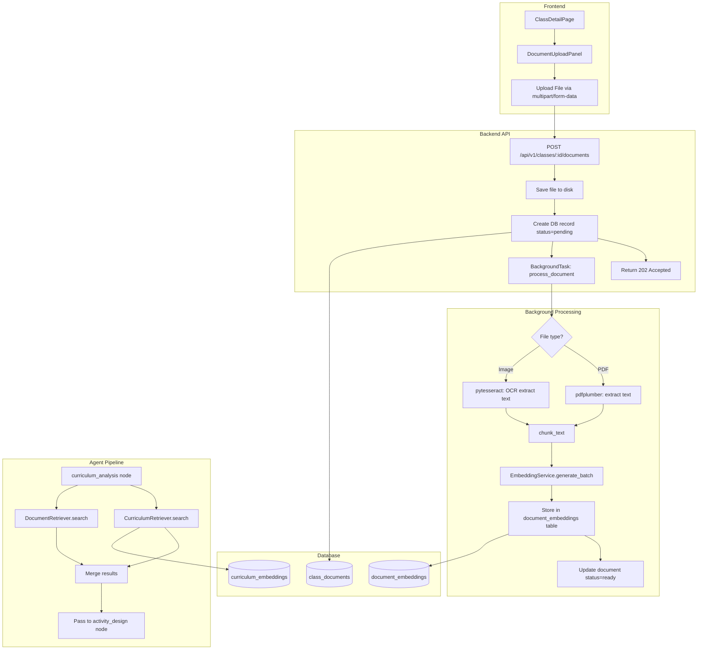
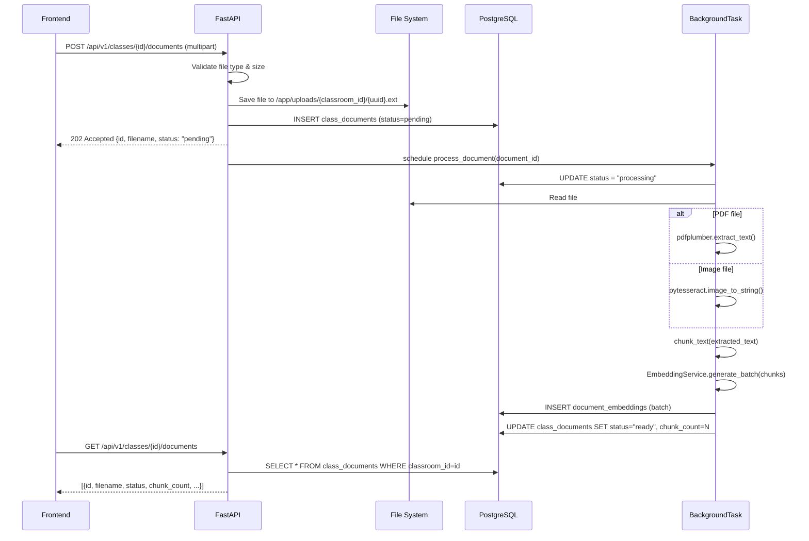
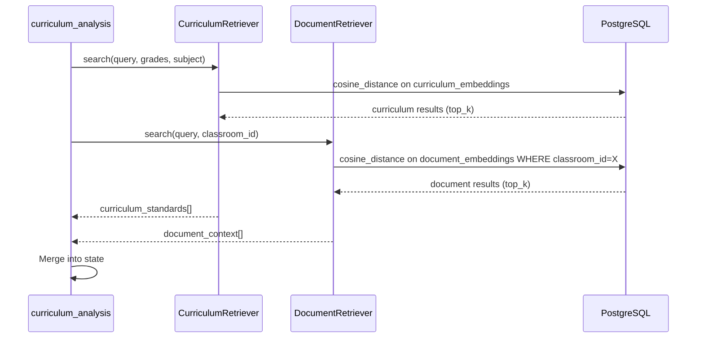

# Design Document: Class Document Upload

## Overview

This feature adds document upload functionality to the class detail view in Aula Múltiple. Teachers can upload PDF and image files (PNG, JPG, JPEG) associated to a specific classroom. The system processes uploads asynchronously in background — extracting text (pdfplumber for PDFs, Tesseract OCR for images), chunking, generating embeddings via the existing sentence-transformers service, and storing vectors in pgvector. The agent's `curriculum_analysis` node is extended to query both global curriculum embeddings and class-specific document embeddings when generating activities, providing richer contextual grounding.

The processing pipeline is non-blocking: the upload endpoint returns HTTP 202 immediately, and a background task handles the full extraction → chunk → embed → store pipeline. Document status is tracked via a state machine (`pending` → `processing` → `ready` | `error`), allowing the frontend to poll or display processing state.

## Architecture




## Sequence Diagrams

### Upload Flow



### Agent Query Flow (Activity Generation with Documents)




## Components and Interfaces

### Component 1: Document Upload API (`app/api/documents.py`)

**Purpose**: Handles file upload, validation, storage, and triggers background processing.

**Interface**:
```python
router = APIRouter(prefix="/classes/{class_id}/documents", tags=["documents"])

@router.post("", status_code=202)
async def upload_document(
    class_id: int,
    file: UploadFile,
    background_tasks: BackgroundTasks,
    current_user: User = Depends(get_current_user),
    db: AsyncSession = Depends(get_db),
) -> DocumentResponse: ...

@router.get("", response_model=list[DocumentResponse])
async def list_documents(
    class_id: int,
    current_user: User = Depends(get_current_user),
    db: AsyncSession = Depends(get_db),
) -> list[DocumentResponse]: ...

@router.delete("/{document_id}", status_code=204)
async def delete_document(
    class_id: int,
    document_id: int,
    current_user: User = Depends(get_current_user),
    db: AsyncSession = Depends(get_db),
) -> None: ...
```

**Responsibilities**:
- Validate file MIME type (PDF, PNG, JPG, JPEG) and size (max 10MB)
- Persist file to local filesystem under `/app/uploads/{classroom_id}/`
- Create `class_documents` DB record with `status=pending`
- Enqueue background processing via FastAPI `BackgroundTasks`
- List documents for a classroom (only owner can access)
- Delete document and associated embeddings + file

### Component 2: Document Processing Service (`app/services/document_processor.py`)

**Purpose**: Orchestrates the background pipeline: text extraction → chunking → embedding → storage.

**Interface**:
```python
class DocumentProcessor:
    def __init__(self, session_factory: async_sessionmaker, embedding_service: EmbeddingService): ...
    
    async def process(self, document_id: int) -> None: ...
    
    def extract_text_from_pdf(self, file_path: Path) -> str: ...
    
    def extract_text_from_image(self, file_path: Path) -> str: ...
    
    def chunk_text(self, text: str, chunk_size: int = 500, chunk_overlap: int = 50) -> list[str]: ...
```

**Responsibilities**:
- Route to correct extractor based on file extension
- Extract text (pdfplumber for PDF, pytesseract for images)
- Chunk extracted text with configurable size/overlap
- Generate embeddings in batch via `EmbeddingService`
- Store embeddings in `document_embeddings` table with deduplication
- Update document status (`processing` → `ready` | `error`)
- Handle errors gracefully and record error message

### Component 3: Document Retriever (`app/rag/document_retriever.py`)

**Purpose**: Performs semantic search over class-specific document embeddings.

**Interface**:
```python
class DocumentRetriever:
    def __init__(self, session: AsyncSession, embedding_service: EmbeddingService): ...
    
    async def search(
        self,
        query: str,
        classroom_id: int,
        top_k: int = 5,
        similarity_threshold: float = 0.65,
    ) -> list[DocumentChunk]: ...
```

**Responsibilities**:
- Generate query embedding
- Execute cosine similarity search filtered by `classroom_id`
- Return top-k chunks above similarity threshold
- Used by `curriculum_analysis` node during activity generation


## Data Models

### Model 1: ClassDocument (`app/models/class_document.py`)

```python
class ClassDocument(Base):
    """A document uploaded by a teacher and associated to a classroom."""
    
    __tablename__ = "class_documents"
    
    id = Column(Integer, primary_key=True)
    classroom_id = Column(Integer, ForeignKey("classrooms.id", ondelete="CASCADE"), nullable=False, index=True)
    user_id = Column(Integer, ForeignKey("users.id"), nullable=False, index=True)
    filename = Column(String(255), nullable=False)
    original_filename = Column(String(255), nullable=False)
    file_path = Column(String(512), nullable=False)
    mime_type = Column(String(100), nullable=False)
    file_size_bytes = Column(Integer, nullable=False)
    status = Column(String(20), nullable=False, default="pending")  # pending | processing | ready | error
    error_message = Column(Text, nullable=True)
    chunk_count = Column(Integer, nullable=True)
    uploaded_at = Column(DateTime(timezone=True), server_default=text("now()"), nullable=False)
    processed_at = Column(DateTime(timezone=True), nullable=True)
    
    # Relationships
    classroom = relationship("Classroom", back_populates="documents")
    user = relationship("User")
    embeddings = relationship("DocumentEmbedding", back_populates="document", cascade="all, delete-orphan")
```

**Validation Rules**:
- `status` must be one of: `pending`, `processing`, `ready`, `error`
- `mime_type` must be one of: `application/pdf`, `image/png`, `image/jpeg`
- `file_size_bytes` must be <= 10_485_760 (10 MB)
- `classroom_id` must reference an existing classroom owned by the user

### Model 2: DocumentEmbedding (`app/models/document_embedding.py`)

```python
class DocumentEmbedding(Base):
    """Vectorized chunk from a class document for RAG retrieval."""
    
    __tablename__ = "document_embeddings"
    
    id = Column(Integer, primary_key=True)
    document_id = Column(Integer, ForeignKey("class_documents.id", ondelete="CASCADE"), nullable=False, index=True)
    classroom_id = Column(Integer, ForeignKey("classrooms.id", ondelete="CASCADE"), nullable=False, index=True)
    content = Column(Text, nullable=False)
    content_hash = Column(String(64), nullable=False)
    chunk_index = Column(Integer, nullable=False)
    embedding = Column(Vector(384), nullable=False)
    created_at = Column(DateTime(timezone=True), server_default=text("now()"), nullable=False)
    
    # Relationships
    document = relationship("ClassDocument", back_populates="embeddings")
    
    # Constraints
    __table_args__ = (
        UniqueConstraint("document_id", "content_hash", name="uq_doc_chunk_hash"),
        Index("ix_doc_embed_classroom", "classroom_id"),
    )
```

**Validation Rules**:
- `content_hash` is SHA-256 of the chunk text (deduplication per document)
- `embedding` is a 384-dimensional vector (matches all-MiniLM-L6-v2)
- `classroom_id` is denormalized from the parent document for query performance (avoids JOIN in vector search)

### Schema: DocumentResponse (`app/schemas/document.py`)

```python
class DocumentResponse(BaseModel):
    id: int
    classroom_id: int
    filename: str
    original_filename: str
    mime_type: str
    file_size_bytes: int
    status: str  # pending | processing | ready | error
    error_message: str | None = None
    chunk_count: int | None = None
    uploaded_at: datetime
    processed_at: datetime | None = None
    
    model_config = ConfigDict(from_attributes=True)

class DocumentChunk(BaseModel):
    """A retrieved chunk from a class document."""
    content: str
    document_filename: str
    similarity_score: float
```


## Key Functions with Formal Specifications

### Function 1: upload_document()

```python
async def upload_document(
    class_id: int,
    file: UploadFile,
    background_tasks: BackgroundTasks,
    current_user: User,
    db: AsyncSession,
) -> DocumentResponse:
```

**Preconditions:**
- `current_user` is authenticated and owns the classroom with `class_id`
- `file.content_type` is in `{"application/pdf", "image/png", "image/jpeg"}`
- `file.size` <= 10_485_760 bytes (10 MB)
- Classroom with `class_id` exists in DB

**Postconditions:**
- File is persisted at `/app/uploads/{class_id}/{uuid}.{ext}`
- A `class_documents` row is created with `status="pending"`
- A background task is enqueued that will call `DocumentProcessor.process(document_id)`
- Returns HTTP 202 with the `DocumentResponse`
- No modification to existing data

### Function 2: DocumentProcessor.process()

```python
async def process(self, document_id: int) -> None:
```

**Preconditions:**
- `document_id` references a valid `class_documents` row with `status="pending"`
- The file at `document.file_path` exists and is readable
- `EmbeddingService` is initialized

**Postconditions:**
- If successful:
  - `document.status == "ready"`
  - `document.processed_at` is set to current timestamp
  - `document.chunk_count` equals the number of chunks generated
  - `document_embeddings` contains one row per unique chunk with valid 384d vectors
- If error:
  - `document.status == "error"`
  - `document.error_message` contains a descriptive error string
  - No partial embeddings are stored (transaction rolled back)
- The file on disk is NOT deleted regardless of outcome

**Loop Invariants:**
- During chunking: all generated chunks are non-empty strings
- During embedding batch: number of embeddings == number of chunks
- During DB insert: all embeddings have valid content_hash unique within the document

### Function 3: DocumentRetriever.search()

```python
async def search(
    self,
    query: str,
    classroom_id: int,
    top_k: int = 5,
    similarity_threshold: float = 0.65,
) -> list[DocumentChunk]:
```

**Preconditions:**
- `query` is a non-empty string
- `classroom_id` is a valid classroom ID
- `top_k` >= 1
- `0.0 < similarity_threshold <= 1.0`

**Postconditions:**
- Returns a list of at most `top_k` `DocumentChunk` objects
- All returned chunks have `similarity_score >= similarity_threshold`
- Results are ordered by `similarity_score` descending
- Only chunks from documents with `status="ready"` belonging to `classroom_id` are considered
- Returns empty list if no documents exist or none meet threshold

### Function 4: extract_text_from_image()

```python
def extract_text_from_image(self, file_path: Path) -> str:
```

**Preconditions:**
- `file_path` points to a valid PNG or JPEG image file
- Tesseract is installed and available in PATH
- Image is readable and not corrupted

**Postconditions:**
- Returns the OCR-extracted text as a string
- If no text is detected, raises `ValueError`
- Original image file is not modified

### Function 5: Enhanced curriculum_analysis node

```python
async def run(state: AgentState) -> dict:
```

**Preconditions:**
- `state["topic"]`, `state["grades"]`, `state["subject"]` are populated
- `state["classroom_id"]` is populated (new field)
- EmbeddingService and DB session are available

**Postconditions:**
- `curriculum_standards` contains results from global curriculum search
- `document_context` contains results from class-specific document search (new field)
- Both searches execute independently; one failing doesn't block the other
- If `classroom_id` has no documents, `document_context` is an empty list


## Algorithmic Pseudocode

### Document Processing Pipeline

```python
async def process(self, document_id: int) -> None:
    """
    Full background processing pipeline for an uploaded document.
    
    ALGORITHM:
    1. Load document record, update status to "processing"
    2. Extract text based on file type (PDF or image OCR)
    3. Chunk text into overlapping segments
    4. Generate embeddings in batch
    5. Deduplicate by content_hash within this document
    6. Store embeddings in pgvector
    7. Update document status to "ready" with chunk_count
    
    ERROR HANDLING:
    - Any exception → rollback, set status="error", record message
    """
    async with self.session_factory() as session:
        # Step 1: Load and lock document
        document = await session.get(ClassDocument, document_id)
        if document is None or document.status != "pending":
            return
        
        document.status = "processing"
        await session.commit()
        
        try:
            # Step 2: Extract text based on MIME type
            file_path = Path(document.file_path)
            if document.mime_type == "application/pdf":
                extracted_text = self.extract_text_from_pdf(file_path)
            else:  # image/png or image/jpeg
                extracted_text = self.extract_text_from_image(file_path)
            
            if not extracted_text.strip():
                raise ValueError("No se pudo extraer texto del documento")
            
            # Step 3: Chunk text
            chunks = self.chunk_text(extracted_text, chunk_size=500, chunk_overlap=50)
            # INVARIANT: all(len(c.strip()) > 0 for c in chunks)
            
            # Step 4: Generate embeddings in batch
            embeddings = await self.embedding_service.generate_batch(chunks)
            # INVARIANT: len(embeddings) == len(chunks)
            
            # Step 5: Compute hashes and deduplicate
            chunk_hashes = [hashlib.sha256(c.encode()).hexdigest() for c in chunks]
            
            # Step 6: Store embeddings
            records = [
                DocumentEmbedding(
                    document_id=document.id,
                    classroom_id=document.classroom_id,
                    content=chunk,
                    content_hash=chunk_hash,
                    chunk_index=idx,
                    embedding=embedding,
                )
                for idx, (chunk, chunk_hash, embedding)
                in enumerate(zip(chunks, chunk_hashes, embeddings))
            ]
            session.add_all(records)
            
            # Step 7: Mark as ready
            document.status = "ready"
            document.chunk_count = len(records)
            document.processed_at = func.now()
            await session.commit()
            
        except Exception as exc:
            await session.rollback()
            # Re-fetch to update status
            document = await session.get(ClassDocument, document_id)
            if document:
                document.status = "error"
                document.error_message = str(exc)[:500]
                await session.commit()
```

### Document Retrieval Algorithm

```python
async def search(
    self,
    query: str,
    classroom_id: int,
    top_k: int = 5,
    similarity_threshold: float = 0.65,
) -> list[DocumentChunk]:
    """
    Semantic search over document embeddings for a specific classroom.
    
    ALGORITHM:
    1. Generate query embedding (384d via sentence-transformers)
    2. Compute cosine similarity against document_embeddings WHERE classroom_id matches
    3. Filter by threshold, order by similarity desc, limit to top_k
    4. JOIN with class_documents to get filename, filter status="ready"
    5. Return DocumentChunk results
    """
    # Step 1: Generate query embedding
    query_embedding = await self.embedding_service.generate(query)
    
    # Step 2-4: Build query with cosine distance
    distance = DocumentEmbedding.embedding.cosine_distance(query_embedding)
    similarity = (1 - distance).label("similarity_score")
    
    stmt = (
        select(
            DocumentEmbedding.content,
            ClassDocument.original_filename,
            similarity,
        )
        .join(ClassDocument, DocumentEmbedding.document_id == ClassDocument.id)
        .where(
            DocumentEmbedding.classroom_id == classroom_id,
            ClassDocument.status == "ready",
            (1 - distance) >= similarity_threshold,
        )
        .order_by(distance.asc())
        .limit(top_k)
    )
    
    result = await self.session.execute(stmt)
    rows = result.all()
    
    # Step 5: Map to domain objects
    return [
        DocumentChunk(
            content=row.content,
            document_filename=row.original_filename,
            similarity_score=row.similarity_score,
        )
        for row in rows
    ]
```


### Enhanced Curriculum Analysis Node

```python
async def run(state: AgentState) -> dict:
    """
    Extended curriculum_analysis node that queries both global curriculum
    and class-specific documents.
    
    ALGORITHM:
    1. Query global curriculum_embeddings (existing behavior)
    2. If classroom_id is present, query document_embeddings for that classroom
    3. Merge both result sets into state
    4. Failures in document search are non-fatal (log and continue)
    """
    curriculum_standards = []
    document_context = []
    
    # Step 1: Global curriculum retrieval (existing)
    try:
        results = await consultar_estandares(
            query=state["topic"],
            grades=state["grades"],
            subject=state["subject"],
        )
        curriculum_standards = [
            CurriculumStandard(
                country=item["country"],
                grade=item["grade"],
                subject=item["subject"],
                text=item["text"],
                similarity_score=item.get("score"),
            )
            for item in results
        ]
    except Exception as exc:
        logger.error("curriculum retrieval failed: %s", exc)
    
    # Step 2: Class-specific document retrieval (new)
    classroom_id = state.get("classroom_id")
    if classroom_id:
        try:
            async with async_session_factory() as session:
                retriever = DocumentRetriever(
                    session=session,
                    embedding_service=_get_embedding_service(),
                )
                document_context = await retriever.search(
                    query=state["topic"],
                    classroom_id=classroom_id,
                    top_k=5,
                )
        except Exception as exc:
            logger.warning("document retrieval failed (non-fatal): %s", exc)
    
    return {
        "curriculum_standards": curriculum_standards,
        "document_context": document_context,
        "current_node": "curriculum_analysis",
    }
```

## Example Usage

### Backend: Upload Endpoint

```python
# Client uploads a PDF
import httpx

async def upload_document_example():
    async with httpx.AsyncClient() as client:
        with open("guia_docente.pdf", "rb") as f:
            response = await client.post(
                "http://localhost:8000/api/v1/classes/1/documents",
                files={"file": ("guia_docente.pdf", f, "application/pdf")},
                headers={"Authorization": "Bearer <token>"},
            )
        # Returns 202
        # {"id": 1, "filename": "abc123.pdf", "original_filename": "guia_docente.pdf",
        #  "status": "pending", "chunk_count": null, ...}
```

### Frontend: Upload Component

```typescript
// DocumentUploadPanel.tsx
async function handleFileUpload(file: File, classId: number) {
  const formData = new FormData();
  formData.append("file", file);
  
  const response = await api.post(
    `/api/v1/classes/${classId}/documents`,
    formData,
    { headers: { "Content-Type": "multipart/form-data" } }
  );
  
  // response.status === 202
  // Add to local state with status "pending"
  addDocument(response.data);
  
  // Start polling for status update
  pollDocumentStatus(response.data.id);
}
```

### Agent: Activity Generation with Document Context

```python
# The agent state now includes document_context
state = AgentState(
    topic="Fracciones equivalentes",
    grades=[3, 4, 5],
    subject="Matemáticas",
    classroom_id=1,  # NEW: triggers document retrieval
    available_resources=[],
)

# After curriculum_analysis node runs:
# state["curriculum_standards"] = [CurriculumStandard(...), ...]
# state["document_context"] = [DocumentChunk(content="...", document_filename="guia.pdf", ...)]
```


## Correctness Properties

*A property is a characteristic or behavior that should hold true across all valid executions of a system — essentially, a formal statement about what the system should do. Properties serve as the bridge between human-readable specifications and machine-verifiable correctness guarantees.*

### Property 1: Upload Integrity

*For any* valid file upload that returns HTTP 202, a file exists on disk at the stored path AND a row exists in `class_documents` with `status="pending"` and correct metadata (filename, mime_type, file_size_bytes, classroom_id, user_id).

**Validates: Requirements 1.1**

### Property 2: Processing Completeness

*For any* document with `status="ready"`, `document.chunk_count` equals the actual count of `document_embeddings` rows where `document_id` matches that document.

**Validates: Requirements 3.7, 5.3**

### Property 3: Embedding Dimensionality

*For any* embedding stored in `document_embeddings`, the vector has exactly 384 dimensions.

**Validates: Requirements 3.5, 10.1**

### Property 4: Hash Uniqueness per Document

*For any* document, no two embeddings within that document share the same `content_hash`.

**Validates: Requirement 10.2**

### Property 5: Ownership Isolation

*For any* user who does not own a classroom, all upload, list, and delete operations on that classroom's documents are rejected with HTTP 404.

**Validates: Requirements 8.1, 8.2**

### Property 6: Retrieval Correctness

*For any* search query with a given `classroom_id`, all returned results belong to that `classroom_id` AND have parent document `status="ready"` AND have `similarity_score >= threshold` AND are ordered by similarity score descending AND the result count is at most `top_k`.

**Validates: Requirements 6.1, 6.2, 6.3, 6.4, 8.3**

### Property 7: Status Machine Validity

*For any* document, status transitions follow exactly: `pending → processing → ready` OR `pending → processing → error`. No other transitions are permitted.

**Validates: Requirements 5.1, 5.2**

### Property 8: File Type Enforcement

*For any* uploaded file with MIME type not in `{application/pdf, image/png, image/jpeg}`, the Upload_API rejects the request with HTTP 422.

**Validates: Requirements 2.1, 2.3**

### Property 9: Size Enforcement

*For any* uploaded file exceeding 10,485,760 bytes, the Upload_API rejects the request with HTTP 422.

**Validates: Requirement 2.2**

### Property 10: Cascade Deletion

*For any* deleted document, zero `document_embeddings` rows exist for that `document_id` AND the physical file no longer exists on disk AND the `class_documents` row is removed.

**Validates: Requirements 9.1, 9.2, 9.3**

### Property 11: Chunking Coverage

*For any* non-empty input text, the concatenation of all chunks (accounting for overlap) reconstructs the original text with no data loss, and every chunk is a non-empty string.

**Validates: Requirement 3.4**

### Property 12: Transaction Atomicity on Failure

*For any* document where processing fails at any stage, zero `document_embeddings` rows exist for that document AND the document status is "error" with a non-empty error_message.

**Validates: Requirements 4.1, 4.2**

### Property 13: Agent Resilience

*For any* execution of the Curriculum_Analysis_Node where document retrieval raises an exception, the node still returns valid `curriculum_standards` results and an empty `document_context` list.

**Validates: Requirement 7.2**

## Error Handling

### Error Scenario 1: Invalid File Type

**Condition**: User uploads a file with unsupported MIME type (e.g., .docx, .mp4)
**Response**: HTTP 422 with message "Tipo de archivo no soportado. Formatos válidos: PDF, PNG, JPG, JPEG"
**Recovery**: No state change. User can retry with a valid file.

### Error Scenario 2: File Too Large

**Condition**: Uploaded file exceeds 10 MB
**Response**: HTTP 422 with message "El archivo excede el tamaño máximo de 10 MB"
**Recovery**: No state change. User can upload a smaller file.

### Error Scenario 3: Text Extraction Failure

**Condition**: pdfplumber or pytesseract cannot extract text (corrupted file, scanned PDF with no OCR layer, blank image)
**Response**: Document status set to `"error"`, `error_message = "No se pudo extraer texto del documento"`
**Recovery**: User can delete the document and re-upload a clearer version. The file remains on disk for debugging.

### Error Scenario 4: Classroom Not Found / Unauthorized

**Condition**: `class_id` doesn't exist or doesn't belong to the authenticated user
**Response**: HTTP 404 "Clase no encontrada"
**Recovery**: No state change.

### Error Scenario 5: Processing Crash (OOM, Tesseract timeout)

**Condition**: Background task crashes during embedding generation or OCR
**Response**: Document remains in `"processing"` state (stale). A periodic health check or retry mechanism can detect stale documents.
**Recovery**: Manual retry endpoint or automatic retry after timeout (future improvement).

### Error Scenario 6: Disk Full

**Condition**: File system cannot store the uploaded file
**Response**: HTTP 500 "Error al guardar el archivo"
**Recovery**: System admin must free disk space. No partial state is created (transaction rolled back).


## Testing Strategy

### Unit Testing Approach

- **DocumentProcessor**: Test `extract_text_from_pdf`, `extract_text_from_image`, `chunk_text` with various inputs
- **DocumentRetriever**: Mock the DB session and verify correct SQL construction
- **Upload endpoint**: Test validation logic (file type, size, ownership) using `httpx.AsyncClient` with TestClient
- **Status transitions**: Verify the state machine enforces valid transitions

### Property-Based Testing Approach

**Property Test Library**: hypothesis (already in requirements.txt)

Key properties to test with hypothesis:
1. `chunk_text` always produces non-empty chunks for non-empty input
2. `chunk_text` chunks cover the entire input text (no data loss)
3. `chunk_text` adjacent chunks overlap by exactly `chunk_overlap` characters
4. `compute_content_hash` is deterministic: same input → same hash
5. `compute_content_hash` is collision-resistant: different inputs → different hashes (probabilistic)
6. Upload validation rejects all files not in the allowed MIME types set

### Integration Testing Approach

- **Full pipeline test**: Upload a test PDF, wait for processing, verify embeddings exist in DB
- **Agent integration test**: Generate an activity for a classroom with documents, verify `document_context` is included in the prompt
- **Deletion cascade test**: Delete a document, verify embeddings are removed and file is deleted from disk

## Performance Considerations

- **Background processing**: Uses FastAPI `BackgroundTasks` (runs in the same process). For production scale, consider migrating to Celery or ARQ with Redis.
- **Batch embedding generation**: `EmbeddingService.generate_batch()` processes all chunks in one `model.encode()` call, leveraging internal parallelization.
- **Vector index**: Add an IVFFlat or HNSW index on `document_embeddings.embedding` once the table exceeds ~10k rows. For initial deployment with few documents per class, sequential scan is acceptable.
- **File size limit (10 MB)**: Prevents excessive memory usage during PDF/image processing in the background task.
- **Chunk size (500 chars, 50 overlap)**: Matches the existing `ingest_curriculum.py` settings for consistency in retrieval quality.
- **OCR performance**: Tesseract on CPU is slow for large images. The 10 MB limit constrains input size. Consider image downscaling if processing time exceeds 30s.

## Security Considerations

- **File type validation**: Validate both the file extension AND the MIME type header. Additionally, read file magic bytes for PDF (`%PDF`) to prevent spoofing.
- **Path traversal**: Use UUID-based filenames on disk, never user-provided filenames. Store `original_filename` only for display.
- **Ownership enforcement**: All endpoints verify that the classroom belongs to the authenticated user via `get_current_user` + ownership check.
- **File storage isolation**: Files are stored in `/app/uploads/{classroom_id}/` with classroom_id validated against ownership.
- **No direct file serving**: Files are NOT served via a public URL. Only processed text/embeddings are queryable.
- **Input sanitization**: Extracted text is stored as-is but never rendered as HTML. The agent uses it as plain context.

## Dependencies

### New Python Dependencies

| Package | Version | Purpose |
|---------|---------|---------|
| `pytesseract` | >=0.3.10,<1.0.0 | Python wrapper for Tesseract OCR |
| `Pillow` | >=10.0.0,<11.0.0 | Image loading for pytesseract |
| `python-multipart` | >=0.0.6,<1.0.0 | Required by FastAPI for file uploads |

### System Dependencies (Dockerfile)

| Package | Purpose |
|---------|---------|
| `tesseract-ocr` | OCR engine for image text extraction |
| `tesseract-ocr-spa` | Spanish language data for Tesseract |

### Existing Dependencies (No Changes)

- `pdfplumber` — PDF text extraction (already in requirements.txt)
- `sentence-transformers` — Embedding generation (already in requirements.txt)
- `pgvector` — Vector storage and similarity search (already in requirements.txt)

### Dockerfile Changes

```dockerfile
FROM python:3.11-slim

# Install Tesseract OCR with Spanish language pack
RUN apt-get update && \
    apt-get install -y --no-install-recommends tesseract-ocr tesseract-ocr-spa && \
    rm -rf /var/lib/apt/lists/*

WORKDIR /app

# Create uploads directory
RUN mkdir -p /app/uploads

COPY requirements.txt .
RUN pip install --no-cache-dir -r requirements.txt

COPY . .

EXPOSE 8000
```

### Docker Compose Volume

```yaml
backend:
  volumes:
    - uploads:/app/uploads

volumes:
  pgdata:
  uploads:
```
