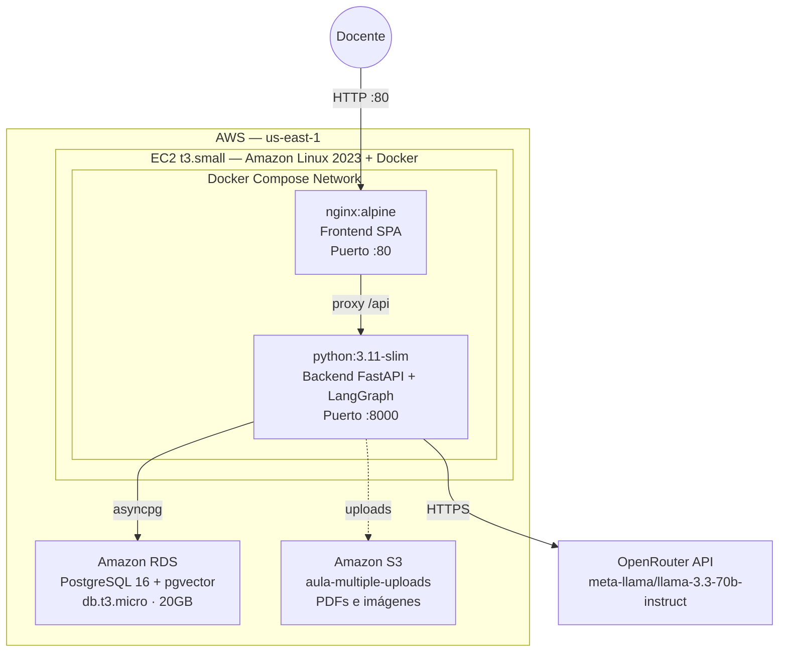
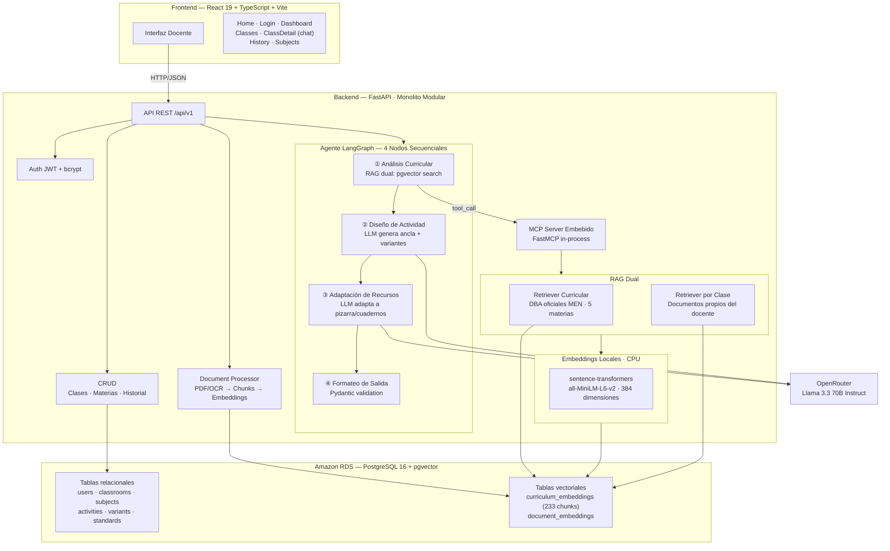
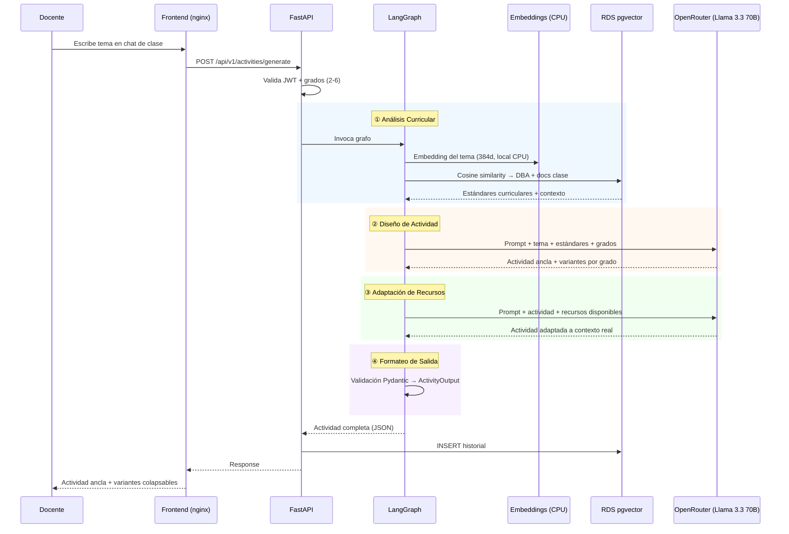
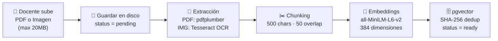
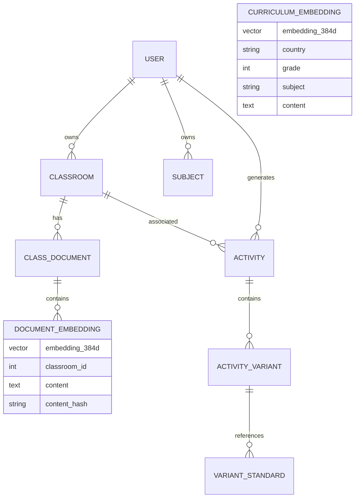

# Aula Múltiple

**Asistente de IA para docentes de escuelas multigrado en zonas rurales de Colombia**

Genera actividades pedagógicas diferenciadas por grado, alineadas a los estándares curriculares oficiales del MEN, para que un solo docente pueda enseñar simultáneamente a estudiantes de distintos niveles sin preparar cada actividad de forma manual.

---

## La Problemática

En Colombia, el 67% de las 55.889 sedes educativas se localiza en zonas rurales. La mayoría opera bajo el modelo multigrado: un solo docente atiende estudiantes de 2 a 6 grados diferentes en la misma aula y al mismo tiempo. Esta realidad, documentada por el DANE y el Laboratorio de Economía de la Educación de la U. Javeriana, implica condiciones estructurales críticas:

- **79,8%** de las sedes rurales no cuenta con acceso a internet.
- **59,7%** carece de aulas de informática.
- **18,1%** no tiene servicio de energía eléctrica.
- Menos de la mitad de los estudiantes que ingresan a primero de primaria en zonas rurales completa sus estudios.

El docente multigrado enfrenta un desafío único: debe planificar contenidos, actividades y evaluaciones diferenciadas para cada grado, todo dentro de una misma sesión de clase. Esto multiplica su carga de planeación por el número de grados que atiende, consumiendo tiempo que podría dedicar a la interacción pedagógica directa.

No existen herramientas digitales diseñadas específicamente para este contexto. Las plataformas educativas existentes asumen aulas monogrado con conectividad estable — una realidad que no corresponde al campo colombiano.

**Fuentes:**

- [DANE — Estadísticas de educación](https://www.dane.gov.co/index.php/estadisticas-por-tema/educacion)
- [Laboratorio de Economía de la Educación, U. Javeriana — Informe sobre educación rural](https://lee.javeriana.edu.co/w/lee-informe-98)
- [La República — Características de la educación en zonas rurales (2023)](https://www.larepublica.co/economia/caracteristicas-de-la-educacion-en-zonas-rurales-3719292)
- [El Espectador — Cifras del panorama de la educación rural](https://www.elespectador.com/educacion/las-cifras-que-muestran-el-complejo-panorama-de-la-educacion-rural-en-colombia/)

---

## La Solución

Aula Múltiple es un agente de inteligencia artificial que automatiza la generación de actividades pedagógicas para aulas multigrado. El docente ingresa un tema, selecciona su clase (con los grados presentes) y la materia. El sistema produce:

1. **Una actividad ancla** — actividad común con un hilo conductor que permite la participación colaborativa entre todos los grados.
2. **Variantes diferenciadas por grado** — cada variante ajusta vocabulario, instrucciones y ejercicios al nivel cognitivo correspondiente.
3. **Alineación curricular verificable** — cada variante referencia explícitamente los Derechos Básicos de Aprendizaje (DBA) del MEN de Colombia correspondientes al grado y materia.

El sistema también valida que el tema solicitado corresponda a la malla curricular oficial. Si un docente solicita un tema fuera del currículo para un grado específico, el agente lo notifica y genera la actividad basándose en los estándares que sí corresponden.

### Impacto esperado

- Reducción del tiempo de planeación diferenciada de horas a minutos.
- Garantía de alineación curricular con los DBA oficiales del MEN.
- Actividades ejecutables directamente, adaptadas a los recursos reales del docente (pizarra, cuadernos, material reciclable).
- Historial reutilizable organizado por clase y materia.

---

## Demo

<!-- VIDEO DEMO PLACEHOLDER -->
[](https://www.youtube.com/watch?v=dsCg-1HTFEA)


**Deploy:** [http://54.83.132.113](http://54.83.132.113)

---

## Arquitectura

### Infraestructura AWS (Producción)



### Arquitectura de la Aplicación



### Pipeline de Generación de Actividades



### Pipeline de Procesamiento de Documentos



---

## Innovación Técnica

| Componente | Decisión | Ventaja competitiva |
| --- | --- | --- |
| **Agente LangGraph con 4 nodos** | Pipeline secuencial orquestado como grafo de estados | Cada nodo tiene responsabilidad única; el flujo es trazable y depurable |
| **RAG Dual (global + por clase)** | Dos retrievers independientes consultan pgvector | Combina currículo oficial con material propio del docente |
| **Embeddings locales** | sentence-transformers (all-MiniLM-L6-v2, 384d) corriendo en CPU | Sin costo, sin dependencia de API externa, funciona offline para la búsqueda semántica |
| **MCP Server embebido** | Model Context Protocol in-process vía FastMCP | El agente accede a herramientas de consulta curricular como tool calls nativos |
| **Validación curricular en prompt** | El prompt compara tema vs. DBA oficiales | Previene generación de contenido fuera de la malla curricular |
| **Procesamiento de documentos** | Pipeline asíncrono: PDF/OCR → chunking → embedding → pgvector | El docente sube materiales propios que enriquecen la generación |
| **Base de datos unificada** | PostgreSQL con pgvector para datos relacionales + vectoriales | Un solo motor simplifica operaciones y deployment |
| **Property-based testing** | 20+ propiedades formales verificadas con Hypothesis | Garantías de corrección sobre invariantes del sistema |

### Frente a alternativas existentes

Las plataformas educativas con IA actuales (ChatGPT, Gemini, herramientas de lesson planning) no resuelven el problema multigrado porque:

- Generan actividades para un solo grado a la vez.
- No conocen ni validan contra currículos oficiales latinoamericanos.
- No producen una actividad ancla compartida con variantes diferenciadas.
- No permiten subir documentos propios como contexto RAG por clase.
- No están diseñadas para operar con recursos mínimos (pizarra y cuadernos).

---

## Stack Tecnológico

**Backend:**

- Python 3.11 · FastAPI · SQLAlchemy 2.0 (async) · Alembic
- LangGraph · LangChain Core · MCP (Model Context Protocol)
- sentence-transformers · pgvector · pdfplumber · pytesseract
- Hypothesis (property-based testing) · pytest

**Frontend:**

- React 19 · TypeScript 6 · Vite 8 · React Router 7
- CSS Modules · Diseño responsivo (min 320px)

**Infraestructura:**

- Docker Compose (nginx + backend + PostgreSQL pgvector)
- Amazon EC2 t3.small · Amazon RDS db.t3.micro · Amazon S3

**LLM:**

- OpenRouter → meta-llama/llama-3.3-70b-instruct

**Datos curriculares:**

- Derechos Básicos de Aprendizaje (DBA) V2 — MEN Colombia
- 5 materias · Grados 1-6 · 233 chunks embedidos

---

## Servicios AWS

| Servicio | Uso en producción |
| --- | --- |
| **Amazon EC2** (t3.small) | Hosting de la aplicación completa via Docker Compose |
| **Amazon RDS** (PostgreSQL 16 + pgvector) | Base de datos relacional y vectorial |
| **Amazon S3** | Almacenamiento de documentos subidos por docentes |

---

## Estructura del Proyecto

```text
aula_multiple/
├── backend/
│   ├── app/
│   │   ├── agent/          # LangGraph: grafo, 4 nodos, prompts, estado
│   │   ├── api/            # Endpoints REST (auth, clases, materias, historial, documentos)
│   │   ├── auth/           # JWT + bcrypt
│   │   ├── crud/           # Operaciones de base de datos
│   │   ├── mcp_server/     # MCP Server embebido (FastMCP)
│   │   ├── models/         # SQLAlchemy models (8 tablas)
│   │   ├── rag/            # Retrievers + servicio de embeddings local
│   │   ├── schemas/        # Pydantic request/response
│   │   └── services/       # Document processor (PDF, OCR, chunking)
│   ├── curriculum_data/    # DBA oficiales en markdown (5 materias)
│   ├── scripts/            # Ingesta de currículo
│   ├── tests/              # 26 archivos de test (property-based + integration)
│   └── Dockerfile
├── frontend/
│   ├── src/
│   │   ├── components/     # Layout, Navbar, Sidebar, ProtectedRoute
│   │   ├── pages/          # Home, Login, Register, Dashboard/*
│   │   ├── services/       # API clients (axios)
│   │   ├── hooks/          # useAuth
│   │   └── types/          # TypeScript interfaces
│   └── Dockerfile
├── docker-compose.yml
└── .env.example
```

---

## Modelo de Datos



---

## Licencia

MIT
